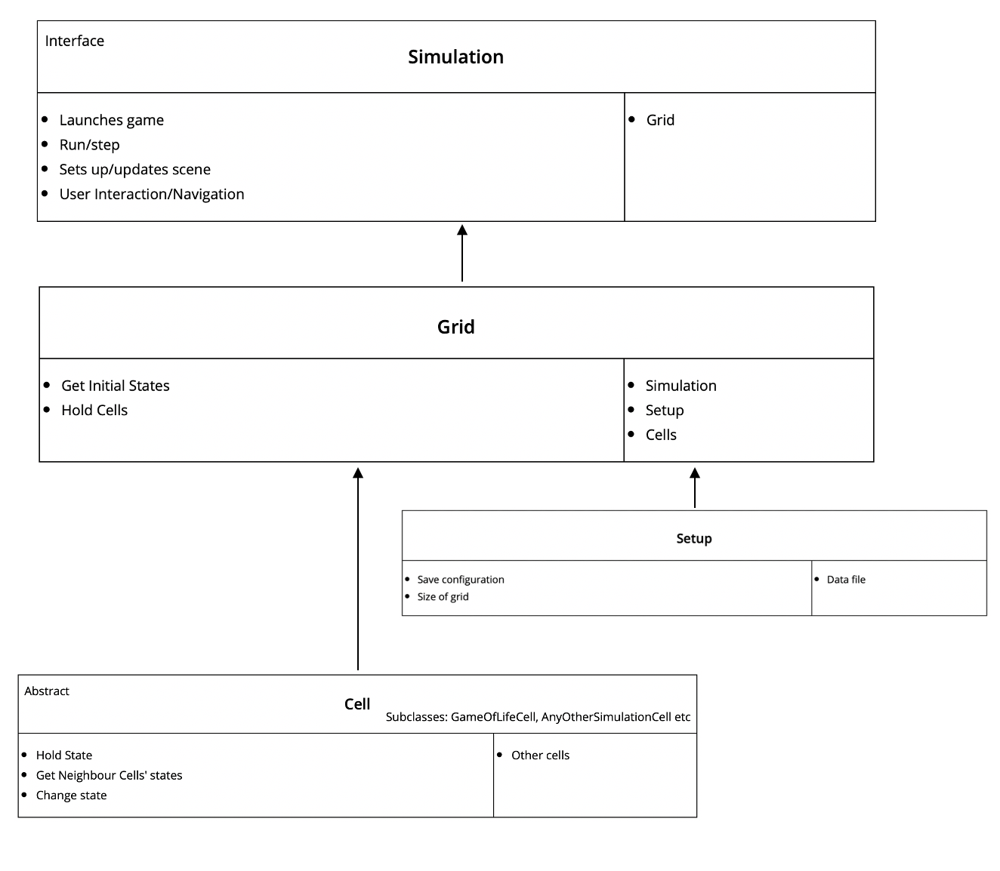
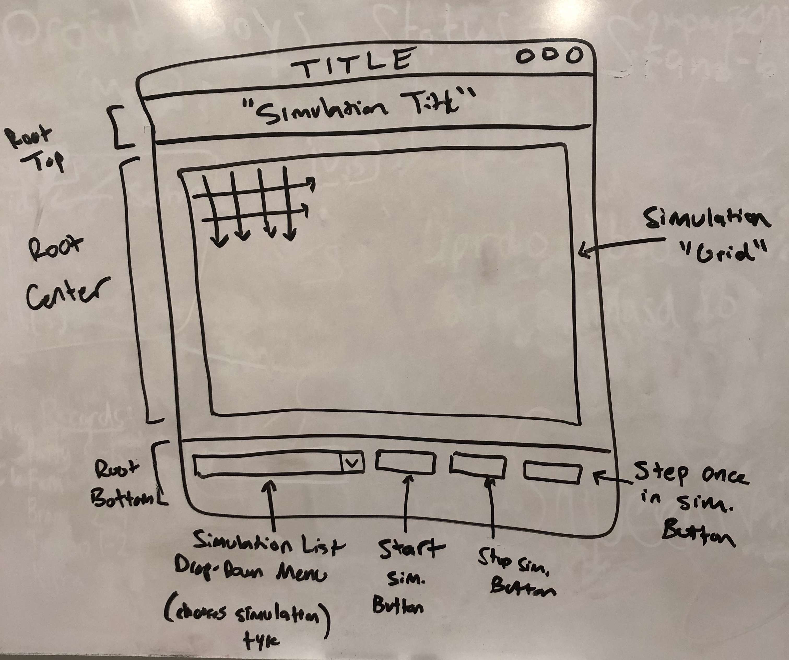

# Simulation Design Plan
### Team Number 18
### Muazzam Khan Noorpuri, Ryan Feinberg, Kenneth Marenco

## Design Overview

## Design Details

Here is a graphical look at my design:

## Design Considerations

**How to separate/implement user interaction apart from the "Grid" object and Simulation model.**
* We decided to handle all user interactions in the Simulation class using appropriate methods from the Setup or Grid classes.

**How to implement simluation "rules" into our model.**
* We could have either stored the game rules in the Grid class or in the individual Cell class, and we chose to store them in the Cell class. This way, all of the Cell's functionality is kept within its own class.

## User Interface

Here is our UI:

## Team Responsibilities

 * Team Member #1

 * Team Member #2

 * Team Member #3
